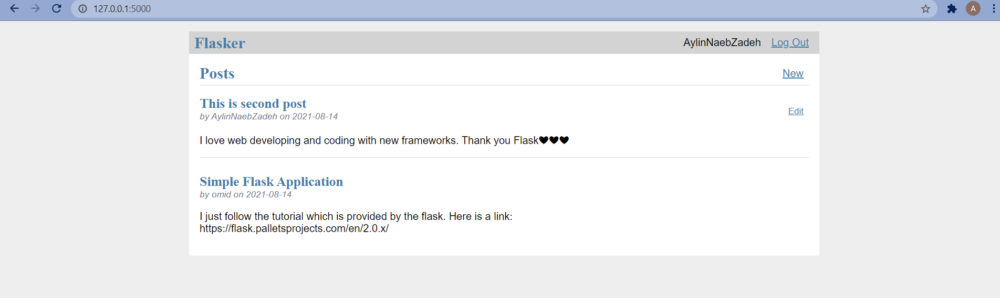

# Flask-Tutorial-Application
I have created this simple project based on [Flask tutorial](https://flask.palletsprojects.com/en/2.0.x/).I followed it step by step and I think it is one of the best docs I have ever read. But the thing I like it most is that every user can see the others posts but we can only delete or edit our own posts not the others.
This app cosists of 2 parts :

```python
Blog(posts)
Auth(users)
```
The other new thing in this project was its test cases which I have never seen before in any projects. For running the flask app first you should create and active the virtual envirnment .
If you have windows this commands will work:

```
  python -m venv new_env 
  new_env\Scripts\active or new_env/Scripts/Activate
  
```

And then run this commands(for me in myproject directory and flaskr is the name of my app (in this example)):

```
set FLASK_APP=flaskr
set FLASK_ENV=development
flask run
```


